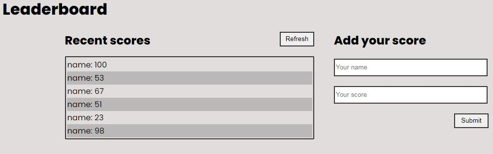

# Leaderboard

In this project i acheived the following

- improved the look and feel of the application, adding the styles of your choice.
- Maintained the general layout of the wireframe
- Used plain CSS to style the page

## Built With

- Webpack
- HTML and CSS
- Javascript

## Getting Started

To get a local copy up and running follow these simple example steps.

### Usage

- Clone this repo to your local machine
- Open the `index.html` in your browser

## Authors

**Gordon Tinyefuza**

- GitHub: [@1GORDON](https://github.com/1GORDON)
- Twitter: [@GTinyefuza](https://twitter.com/Tinyefuza)
- LinkedIn: [LinkedIn](www.linkedin.com/in/tinyefuza-gordon-935747213)

## 🤝 Contributing

Contributions, issues, and feature requests are welcome!

Feel free to check the [issues page](https://github.com/1GORDON/gitflow/issues).

## Show your support

Give a ⭐️ if you like this project!

## Acknowledgments

- Microverse

## 📝 License

This project is [MIT](./MIT.md) licensed.
